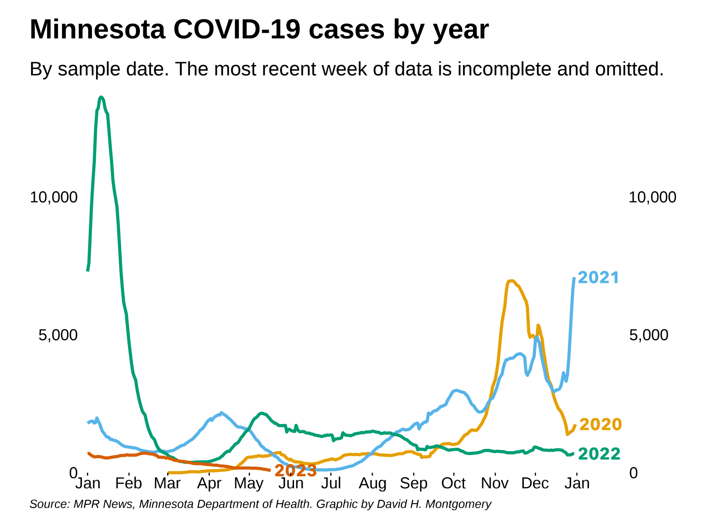
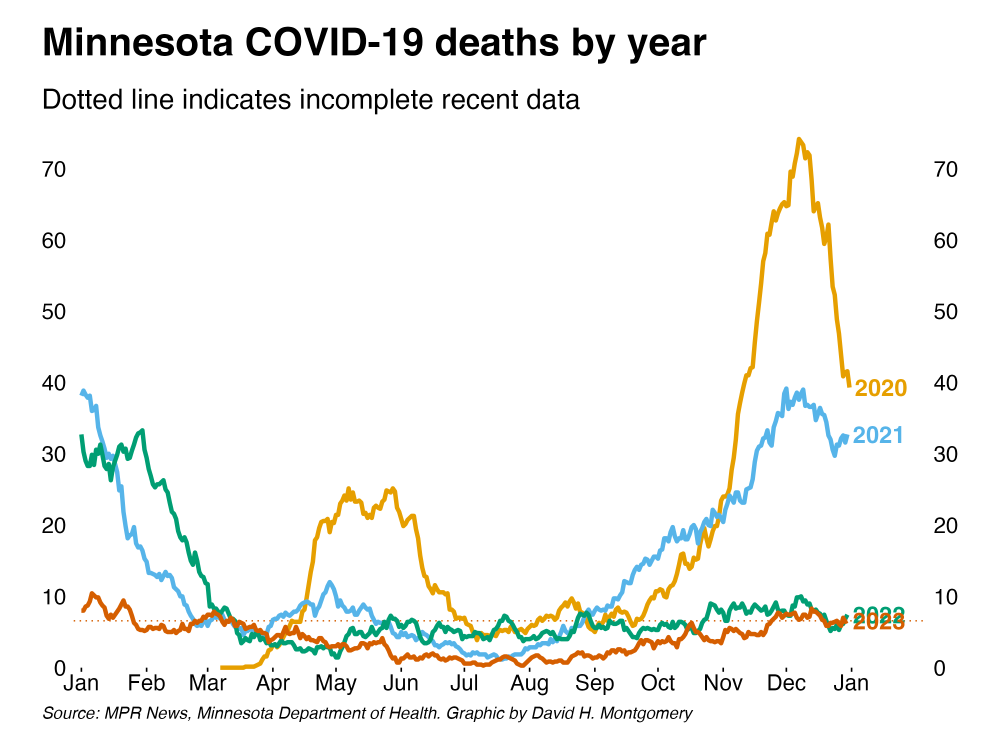
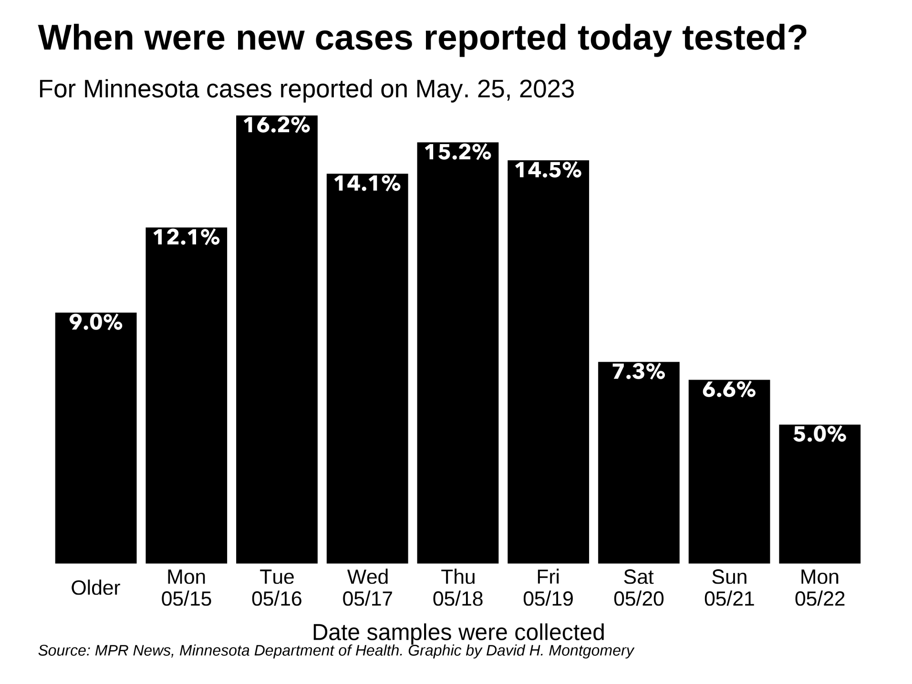
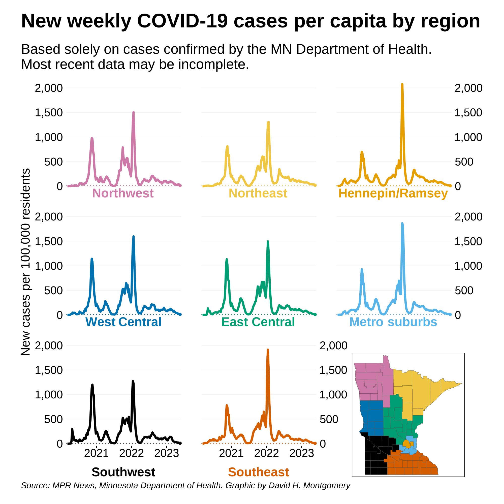
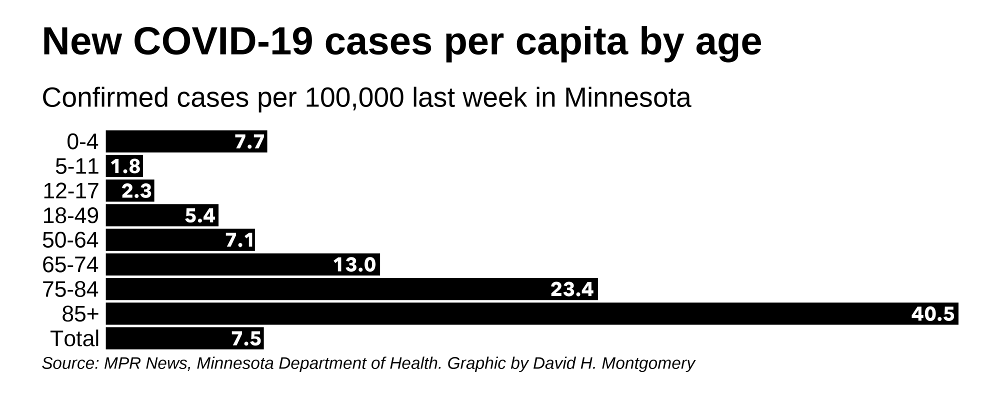
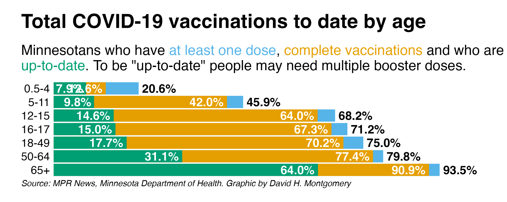
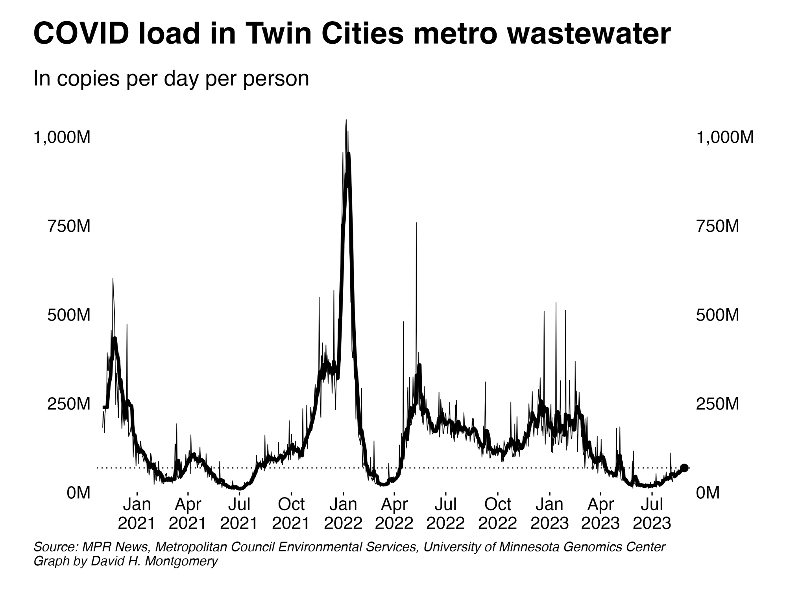

```{r setup, include=FALSE}
knitr::opts_chunk$set(echo = FALSE, message = FALSE, warning = FALSE)
options(scipen = 50)
library(tidyverse)
library(scales)
library(stringr)
library(magick)
library(lubridate)
library(here)
library(kableExtra)
```

```{r loaddata}
covid_trends_actual <- read_csv(here("data/covid_trends_actual.csv"))
covid_data_actual <- read_csv(here("data/covid_data_actual.csv"))
current_report_date <- read_lines(here("data/current_report_date.txt")) %>% as_date()
```


# Overall data {.tabset}

## By actual date

Minnesota reports many COVID-19 metrics based on the date the event actually occurred — the date a test was taken, a person was admitted to the hospital, or died. This data takes some time to stabilize — up to a week for cases, and several weeks for deaths. Below is actual-date data for Minnesota as of `r format(current_report_date - 7, "%B %d, %Y")` — except for deaths, which are as of `r format(current_report_date - 21, "%B %d")`:

```{r table_actual_date}
list(covid_data_actual %>%
	 	filter(cases_complete == TRUE) %>%
	 	filter(date == max(date)) %>%
	 	select(new_cases, new_hosp) %>%
	 	set_names("Cases", "Hospitalizations") %>%
	 	pivot_longer(everything(), values_to = "New"),
	 covid_trends_actual %>%
	 	filter(cases_complete == TRUE) %>%
	 	filter(date == max(date)) %>%
	 	select(new_cases, new_hosp) %>%
	 	set_names("Cases", "Hospitalizations") %>%
	 	pivot_longer(everything(), values_to = "7-day average"),
	 covid_trends_actual %>%
	 	filter(cases_complete == TRUE) %>%
	 	filter(date %in% c(max(date), (max(date) - 7))) %>%
	 	arrange(date) %>%
	 	select(date, new_cases, new_hosp) %>%
	 	set_names("Date", "Cases", "Hospitalizations") %>%
	 	mutate(across(-Date, ~. - lag(.))) %>%
	 	filter(!is.na(Cases)) %>%
	 	select(-Date) %>%
	 	pivot_longer(everything(), values_to = "Past week's change")) %>%
	reduce(left_join, by = "name") %>%
	bind_rows(list(covid_data_actual %>%
				   	filter(deaths_complete == TRUE) %>%
				   	filter(date == max(date)) %>%
				   	select(new_deaths) %>%
				   	set_names("Deaths*") %>%
				   	pivot_longer(everything(), values_to = "New"),
				   covid_trends_actual %>%
				   	filter(deaths_complete == TRUE) %>%
				   	filter(date == max(date)) %>%
				   	select(new_deaths) %>%
				   	set_names("Deaths*") %>%
				   	pivot_longer(everything(), values_to = "7-day average"),
				   covid_trends_actual %>%
				   	filter(deaths_complete == TRUE) %>%
				   	filter(date %in% c(max(date), (max(date) - 7))) %>%
				   	arrange(date) %>%
				   	select(date, new_deaths) %>%
				   	set_names("Date", "Deaths*") %>%
				   	mutate(across(-Date, ~. - lag(.))) %>%
				   	filter(!is.na(`Deaths*`)) %>%
				   	select(-Date) %>%
				   	pivot_longer(everything(), values_to = "Past week's change")) %>%
			  	reduce(left_join, by = "name")) %>%
	mutate(`Past week's change` = signs::signs(`Past week's change`, add_plusses = TRUE)) %>%
	mutate(across(is.numeric, ~comma(., accuracy = .01) %>% str_remove_all("\\.0*$"))) %>%
	kable(col.names = c("", "Most recent", "7-day average", "Past week's change")) %>%
	kable_styling(c("striped"), full_width = FALSE, font_size = 20) %>%
	column_spec(1, bold = TRUE)
```


# Graphs and maps

## Cases



## Hospitalizations {.tabset}

### Admissions


### Bed use


## Deaths {.tabset}



## Other data {.tabset}

### Origin of today's cases



### Rate of change


## Demographics {.tabset}

### Region



### Race


### Age



## Vaccinations {.tabset}

### Total vaccinations


### New doses


### Doses by age



### Vaccination map


## Wastewater analysis {.tabset}

Below are data from [the Metropolitan Council's analysis of Twin Cities wastewater for COVID-19 viral particles](https://metrotransitmn.shinyapps.io/metc-wastewater-covid-monitor/).

### Total COVID load




### Variant share

 

# Download data

### Daily data

Below is a table showing Minnesota's COVID-19 data by actual date. Numbers in <span style="color: red;">red</span> reflect incomplete data and may rise as more data comes in.

```{r}
covid_data_actual %>%
	arrange(desc(date)) %>%
	transmute(date, day, new_cases, 
			  # new_tests, positivity, 
			  new_hosp, new_icu, new_nonicu, new_deaths, cases_complete, deaths_complete) %>%
	# mutate(positivity = percent(positivity, accuracy = .01)) %>%
	mutate(across(is.numeric, comma, accuracy = 1)) %>%
	mutate(across(new_cases:new_nonicu, ~cell_spec(., color = case_when(cases_complete == FALSE ~ "red", TRUE ~ "black")))) %>%
	mutate(new_deaths = cell_spec(new_deaths, color = case_when(deaths_complete == FALSE ~ "red", TRUE ~ "black"))) %>%
	select(-cases_complete, -deaths_complete) %>%
	kable(col.names = c("Date", "Day", "Cases", 
						# "Tests", "Positivity", 
						"Hospitalizations", "ICU admissions", "Non-ICU admissions", "Deaths"),
		  escape = FALSE) %>%
	kable_styling(c("striped", "condensed", "responsive")) %>%
	scroll_box(height = "400px")
```

[Download the raw data](https://github.com/MPR-News/covid-data/raw/master/data/covid_data_actual.csv)

### Seven-day rolling averages

Below is a table showing seven-day rolling averages of Minnesota's COVID-19 data by actual date. Numbers in <span style="color: red;">red</span> reflect incomplete data and may rise as more data comes in.

```{r}
covid_trends_actual %>%
	arrange(desc(date)) %>%
	transmute(date, day, new_cases,
			  # new_tests, positivity, 
			  new_hosp, new_icu, new_nonicu, new_deaths, cases_complete, deaths_complete) %>%
	# mutate(positivity = percent(positivity, accuracy = .01)) %>%
	mutate(across(is.numeric, comma, accuracy = 1)) %>%
	mutate(across(new_cases:new_nonicu, ~cell_spec(., color = case_when(cases_complete == FALSE ~ "red", TRUE ~ "black"))))%>%
	mutate(new_deaths = cell_spec(new_deaths, color = case_when(deaths_complete == FALSE ~ "red", TRUE ~ "black"))) %>%
	select(-cases_complete, -deaths_complete) %>%
	kable(col.names = c("Date", "Day", "Cases", 
						# "Tests", "Positivity", 
						"Hospitalizations", "ICU admissions", "Non-ICU admissions", "Deaths"),
		  escape = FALSE) %>%
	kable_styling(c("striped", "condensed", "responsive")) %>%
	scroll_box(height = "400px")
```

[Download the raw data](https://github.com/MPR-News/covid-data/raw/master/data/covid_trends_actual.csv)

# About this data

The data presented here was collected by MPR News staff through April 1, 2022 from the Minnesota Department of Health. At that point, MPR released its COVID-19 data under a [Creative Commons Attribution-NonCommercial-ShareAlike 4.0 International license](https://creativecommons.org/licenses/by-nc-sa/4.0/), along with accompanying code. The repository is currently maintained by David H. Montgomery.