```{r setup, include=FALSE}
knitr::opts_chunk$set(echo = FALSE, message = FALSE, warning = FALSE)
options(scipen = 50)
library(tidyverse)
library(scales)
library(stringr)
library(magick)
library(lubridate)
library(here)
library(kableExtra)
```

```{r loaddata}
covid_totals_report <- read_csv(here("data/covid_totals_report.csv"))
covid_trends_report_short <- read_csv(here("data/covid_trends_report_short.csv"))
covid_trends_actual <- read_csv(here("data/covid_trends_actual.csv"))
covid_data_report <- read_csv(here("data/covid_data_report.csv"))
covid_data_report_short <- covid_data_report %>%
	select("date", "day", "new_cases", "new_tests", "positivity", "new_hosp", "new_deaths", "active_cases", "new_vax_onedose", "new_vax_complete", "new_vax_boosted")
covid_data_actual <- read_csv(here("data/covid_data_actual.csv"))
current_report_date <- covid_trends_report_short %>% filter(date == max(date)) %>% pull(date)
```


# Overall data {.tabset}

## By report date

On `r format(current_report_date, "%B %d, %Y")`, Minnesota reported the following COVID-19 stats: 

```{r table_report_date}
covid_data_report_short %>%
	filter(date == max(date)) %>%
	mutate(across(is.numeric, comma, accuracy = 1)) %>%
	select(new_cases, new_hosp, new_deaths, active_cases, new_vax_onedose, new_vax_complete, new_vax_boosted) %>%
	set_names("Cases", "Hospitalizations", "Deaths", "Active cases", "Vaccinations (1+ dose)", "Vaccinations (complete)", "Vaccinations (boosters)") %>%
	pivot_longer(everything(), values_to = "New") %>%
	# Add totals column
	left_join(covid_totals_report %>%
			  	filter(date == max(date)) %>%
			  	select(total_positives_reinfections, total_hosp, total_deaths, total_vax_onedose, total_vax_complete, total_vax_boosted) %>%
			  	mutate(across(is.numeric, comma, accuracy = 1)) %>%
			  	set_names("Cases", "Hospitalizations", "Deaths", "Vaccinations (1+ dose)", "Vaccinations (complete)", "Vaccinations (boosters)") %>%
			  	pivot_longer(everything(), values_to = "Total"),
			  by = "name") %>%
	# Add 7-day average column
	left_join(covid_trends_report_short %>%
			  	filter(date == max(date)) %>%
			  	select(-date, -day, -new_tests, -positivity) %>%
			  	mutate(across(is.numeric, comma, accuracy = 1)) %>%
			  	set_names("Cases", "Hospitalizations", "Deaths", "Active cases", "Vaccinations (1+ dose)", "Vaccinations (complete)", "Vaccinations (boosters)") %>%
			  	pivot_longer(everything(), values_to = "7-day average"),
			  by = "name") %>%
	# Add week-over-week change column
	left_join(covid_trends_report_short %>%
			  	filter(date %in% c(max(date), max(date) - 7)) %>% 
			  	select(-day, -new_tests, -positivity) %>%
			  	arrange(date) %>%
			  	set_names("Date", "Cases", "Hospitalizations", "Deaths", "Active cases", "Vaccinations (1+ dose)", "Vaccinations (complete)", "Vaccinations (boosters)") %>%
			  	mutate(across(-Date, ~. - lag(.))) %>%
			  	filter(!is.na(Cases)) %>%
			  	select(-Date) %>%
			  	pivot_longer(everything()) %>%
			  	mutate(value = case_when(value < 0 ~ comma(value, accuracy = 1),
			  							 TRUE ~ comma(value, accuracy = 1, prefix = "+"))) %>%
			  	rename("Past week's change" = "value"),
			  by = "name") %>%
	mutate(Total = replace_na(Total, "")) %>%
	kable(col.names = c("", "Today", "Total", "7-day average", "Past week's change")) %>%
	kable_styling(c("striped"), full_width = FALSE, font_size = 20) %>%
	column_spec(1, bold = TRUE)
```

Notes:

- The "Past week’s change" column indicates the change from the seven-day rolling average one week ago to the average today
- "Vaccinations (1+ dose)" indicates the number of people who have received at least one dose of a COVID-19 vaccine
- "Vaccinations (complete)" indicates the number of people who have received two doses of the Pfizer or Moderna vaccines, or one dose of the Johnson & Johnson vaccine
- "Vaccinations (boosters)" indicates the total number of booster doses given (not the total number of people with one or more booster dose)

## By actual date

Minnesota reports many COVID-19 metrics based on the date the event actually occurred — the date a test was taken, a person was admitted to the hospital, or died. This data takes some time to stabilize — up to a week for cases, and several weeks for deaths. Below is actual-date data for Minnesota as of `r format(current_report_date - 7, "%B %d, %Y")` — except for deaths, which are as of `r format(current_report_date - 21, "%B %d")`:

```{r table_actual_date}
list(covid_data_actual %>%
	 	filter(cases_complete == TRUE) %>%
	 	filter(date == max(date)) %>%
	 	select(new_cases, new_tests, new_hosp) %>%
	 	set_names("Cases", "Tests", "Hospitalizations") %>%
	 	pivot_longer(everything(), values_to = "New"),
	 covid_trends_actual %>%
	 	filter(cases_complete == TRUE) %>%
	 	filter(date == max(date)) %>%
	 	select(new_cases, new_tests, new_hosp) %>%
	 	set_names("Cases", "Tests", "Hospitalizations") %>%
	 	pivot_longer(everything(), values_to = "7-day average"),
	 covid_trends_actual %>%
	 	filter(cases_complete == TRUE) %>%
	 	filter(date %in% c(max(date), (max(date) - 7))) %>%
	 	arrange(date) %>%
	 	select(date, new_cases, new_tests, new_hosp) %>%
	 	set_names("Date", "Cases", "Tests", "Hospitalizations") %>%
	 	mutate(across(-Date, ~. - lag(.))) %>%
	 	filter(!is.na(Cases)) %>%
	 	select(-Date) %>%
	 	pivot_longer(everything(), values_to = "Past week's change")) %>%
	reduce(left_join, by = "name") %>%
	bind_rows(list(covid_data_actual %>%
				   	filter(deaths_complete == TRUE) %>%
				   	filter(date == max(date)) %>%
				   	select(new_deaths) %>%
				   	set_names("Deaths*") %>%
				   	pivot_longer(everything(), values_to = "New"),
				   covid_trends_actual %>%
				   	filter(deaths_complete == TRUE) %>%
				   	filter(date == max(date)) %>%
				   	select(new_deaths) %>%
				   	set_names("Deaths*") %>%
				   	pivot_longer(everything(), values_to = "7-day average"),
				   covid_trends_actual %>%
				   	filter(deaths_complete == TRUE) %>%
				   	filter(date %in% c(max(date), (max(date) - 7))) %>%
				   	arrange(date) %>%
				   	select(date, new_deaths) %>%
				   	set_names("Date", "Deaths*") %>%
				   	mutate(across(-Date, ~. - lag(.))) %>%
				   	filter(!is.na(`Deaths*`)) %>%
				   	select(-Date) %>%
				   	pivot_longer(everything(), values_to = "Past week's change")) %>%
			  	reduce(left_join, by = "name")) %>%
	mutate(across(is.numeric, ~comma(., accuracy = .01) %>% str_remove_all("\\.0*$"))) %>%
	kable(col.names = c("", "Most recent", "7-day average", "Past week's change")) %>%
	kable_styling(c("striped"), full_width = FALSE, font_size = 20) %>%
	column_spec(1, bold = TRUE)
```


# Graphs and maps

## Cases {.tabset} 

### Report date 

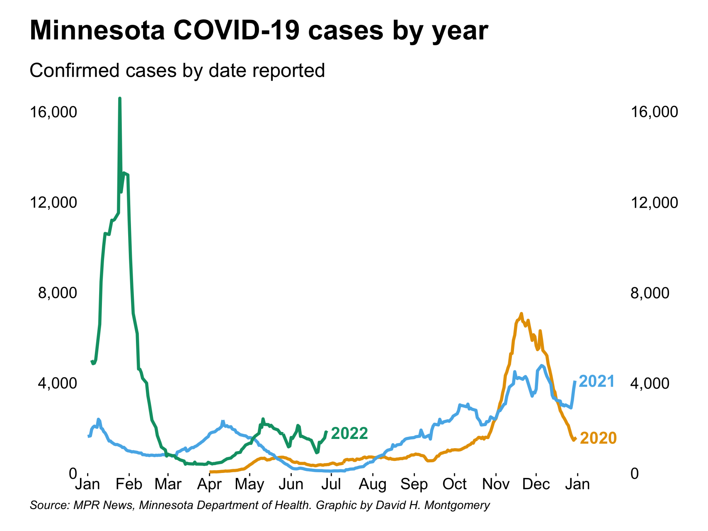

### Actual date 


## Hospitalizations {.tabset}

### Admissions

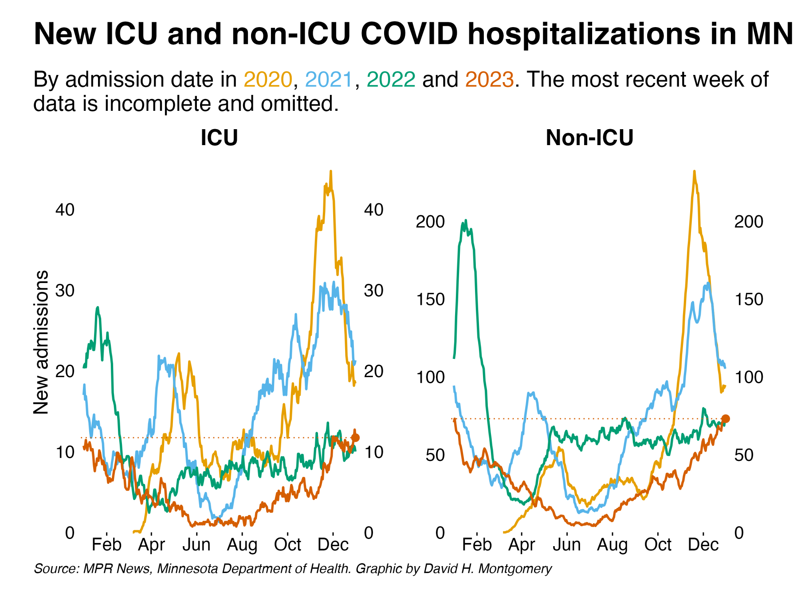

### Bed use

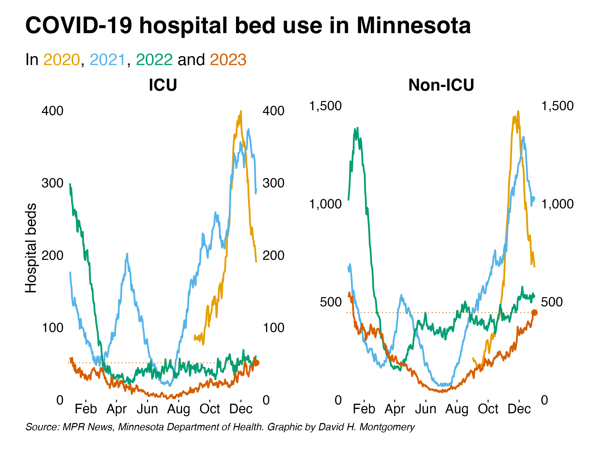

## Deaths {.tabset}

### Report date

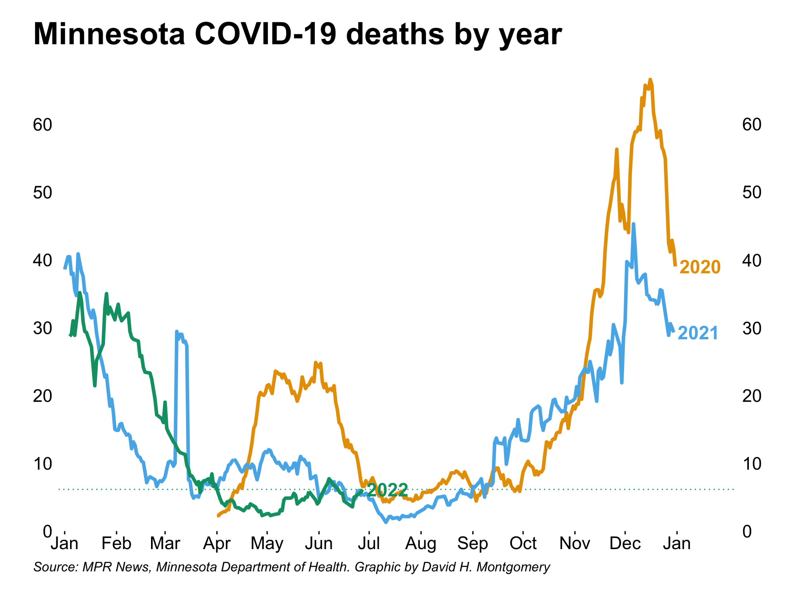

### By long-term care status

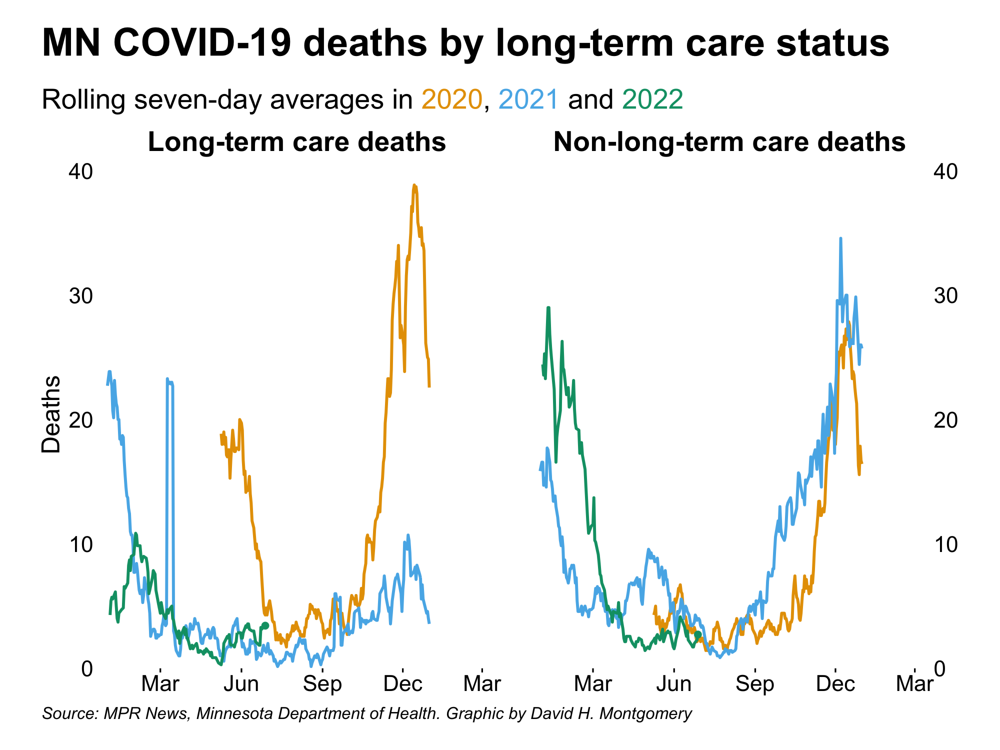

## Other data {.tabset}

### Origin of today's cases


### Rate of change

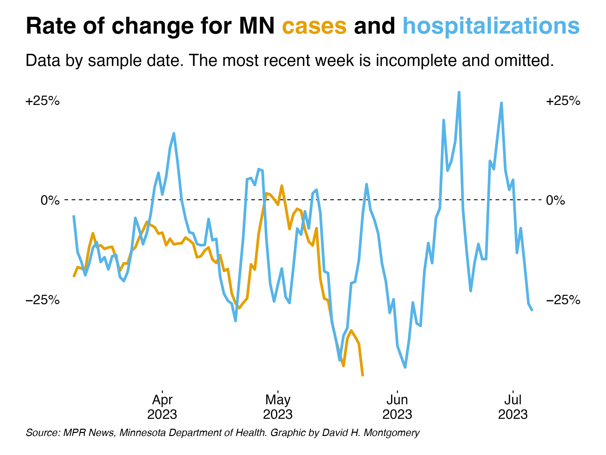

## Demographics {.tabset}

### Region


### Race

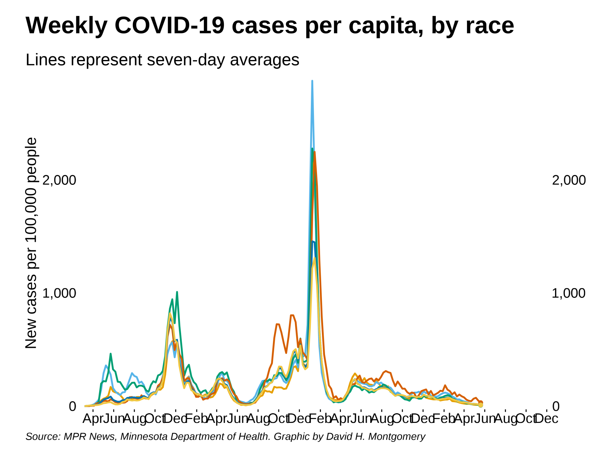

### Age


## Vaccinations {.tabset}

### Total vaccinations

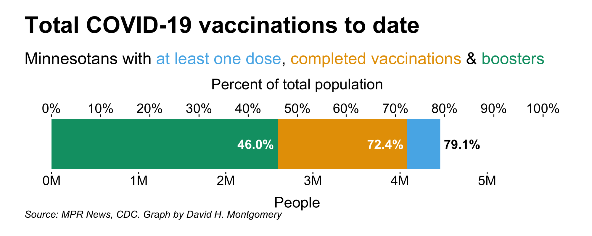

### New doses

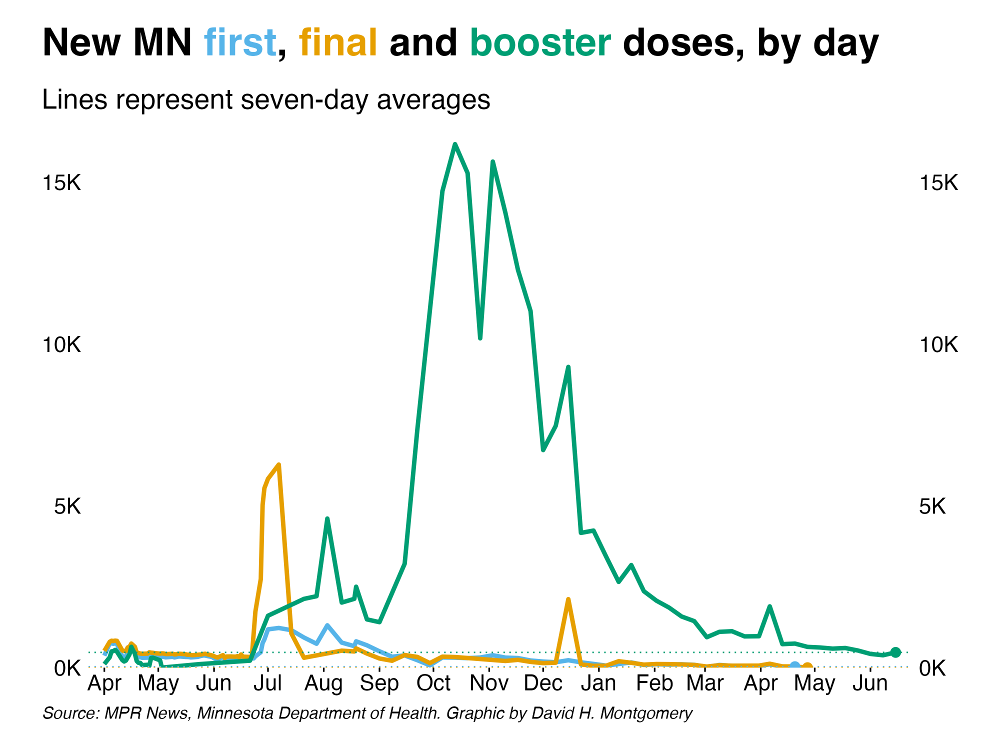

### Doses by age


### Vaccination map

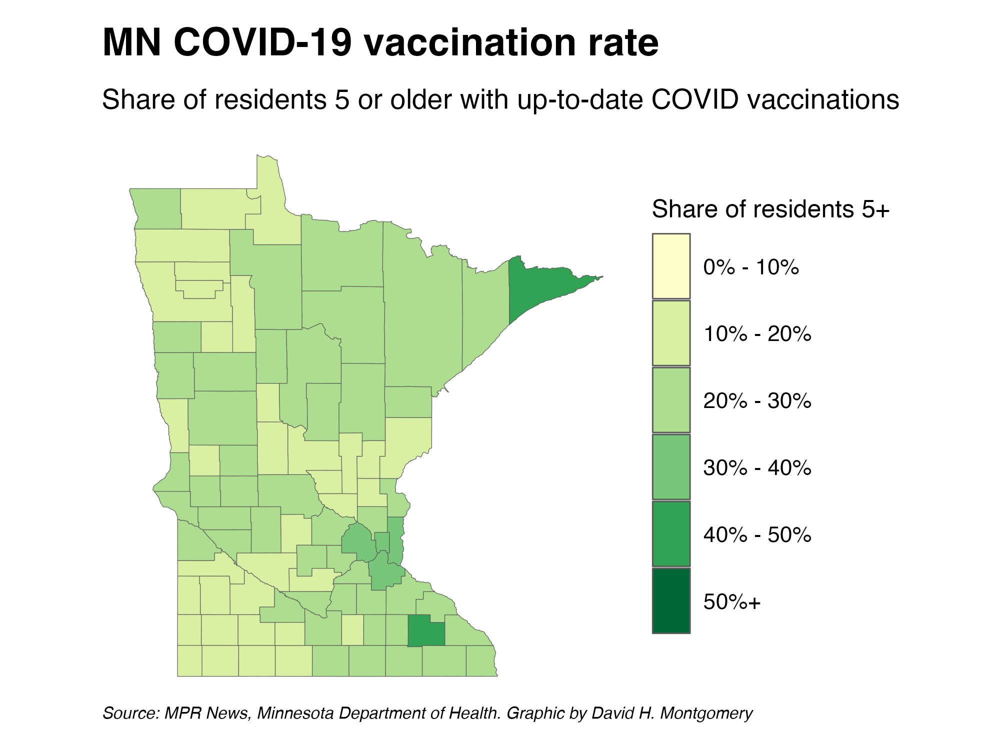

## Wastewater analysis {.tabset}

Below are data from [the Metropolitan Council's analysis of Twin Cities wastewater for COVID-19 viral particles](https://metrotransitmn.shinyapps.io/metc-wastewater-covid-monitor/).

### Total COVID load


### Variant share

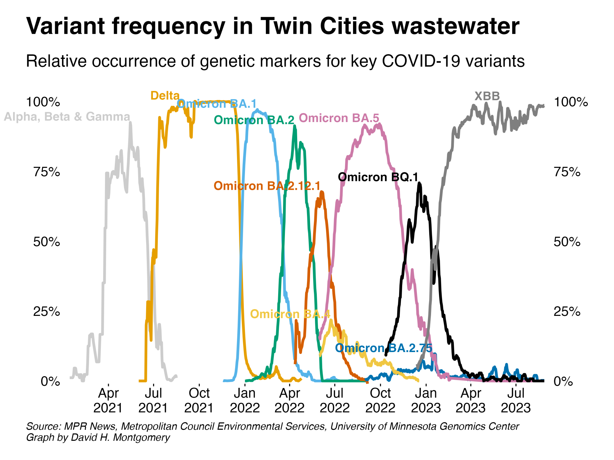 

# Download data {.tabset}

## Report date

### Daily data

Below is a table showing the history of this data dating back to the beginning of the pandemic. 

Note that this data is all by the date the Minnesota Department of Health reported it on [its website](https://www.health.state.mn.us/diseases/coronavirus/situation.html), with some minor adjustments for a few large dumps of backlogged data. It is not based on the date that deaths, hospitalizations, or tests actually occurred.

```{r}
covid_data_report %>%
	arrange(desc(date)) %>%
	select(date, day, new_cases, new_tests, positivity, new_hosp, new_deaths, active_cases, new_vax_onedose, new_vax_complete, new_vax_boosted) %>%
	mutate(positivity = percent(positivity, accuracy = .01)) %>%
	mutate(across(is.numeric, comma, accuracy = 1)) %>%
	kable(col.names = c("Date", "Day", "Cases", "Tests", "Positivity", "Hospitalizations", "Deaths", "Active cases", "Vax 1+ dose", "Vax complete", "Boosters")) %>%
	kable_styling(c("striped", "condensed", "responsive")) %>%
	scroll_box(height = "400px")
```

[Download the raw data](https://github.com/MPR-News/covid-data/raw/master/data/covid_data_report.csv)

### Seven-day rolling averages

Below is data on the rolling seven-day averages for these key COVID-19 statistics in Minnesota:

```{r}
covid_trends_report_short %>%
	arrange(desc(date)) %>%
	mutate(positivity = percent(positivity, accuracy = .01)) %>%
			  	mutate(across(is.numeric, comma, accuracy = 1)) %>%
	kable(col.names = c("Date", "Day", "Cases", "Tests", "Positivity", "Hospitalizations", "Deaths", "Active cases", "Vax 1+ dose", "Vax complete", "Boosters")) %>%
	kable_styling(c("striped", "condensed", "responsive")) %>%
	scroll_box(height = "400px")
```

[Download the raw data](https://github.com/MPR-News/covid-data/raw/master/data/covid_trends_report_short.csv)

## Actual date

### Daily data

Below is a table showing Minnesota's COVID-19 data by actual date. Numbers in <span style="color: red;">red</span> reflect incomplete data and may rise as more data comes in.

```{r}
covid_data_actual %>%
	arrange(desc(date)) %>%
	transmute(date, day, new_cases, new_tests, positivity, new_hosp, new_icu, new_nonicu, new_deaths, cases_complete, deaths_complete) %>%
	mutate(positivity = percent(positivity, accuracy = .01)) %>%
	mutate(across(is.numeric, comma, accuracy = 1)) %>%
	mutate(across(new_cases:new_nonicu, ~cell_spec(., color = case_when(cases_complete == FALSE ~ "red", TRUE ~ "black")))) %>%
	mutate(new_deaths = cell_spec(new_deaths, color = case_when(deaths_complete == FALSE ~ "red", TRUE ~ "black"))) %>%
	select(-cases_complete, -deaths_complete) %>%
	kable(col.names = c("Date", "Day", "Cases", "Tests", "Positivity", "Hospitalizations", "ICU admissions", "Non-ICU admissions", "Deaths"),
		  escape = FALSE) %>%
	kable_styling(c("striped", "condensed", "responsive")) %>%
	scroll_box(height = "400px")
```

[Download the raw data](https://github.com/MPR-News/covid-data/raw/master/data/covid_data_actual.csv)

### Seven-day rolling averages

Below is a table showing seven-day rolling averages of Minnesota's COVID-19 data by actual date. Numbers in <span style="color: red;">red</span> reflect incomplete data and may rise as more data comes in.

```{r}
covid_trends_actual %>%
	arrange(desc(date)) %>%
	transmute(date, day, new_cases, new_tests, positivity, new_hosp, new_icu, new_nonicu, new_deaths, cases_complete, deaths_complete) %>%
	mutate(positivity = percent(positivity, accuracy = .01)) %>%
	mutate(across(is.numeric, comma, accuracy = 1)) %>%
	mutate(across(new_cases:new_nonicu, ~cell_spec(., color = case_when(cases_complete == FALSE ~ "red", TRUE ~ "black"))))%>%
	mutate(new_deaths = cell_spec(new_deaths, color = case_when(deaths_complete == FALSE ~ "red", TRUE ~ "black"))) %>%
	select(-cases_complete, -deaths_complete) %>%
	kable(col.names = c("Date", "Day", "Cases", "Tests", "Positivity", "Hospitalizations", "ICU admissions", "Non-ICU admissions", "Deaths"),
		  escape = FALSE) %>%
	kable_styling(c("striped", "condensed", "responsive")) %>%
	scroll_box(height = "400px")
```

[Download the raw data](https://github.com/MPR-News/covid-data/raw/master/data/covid_trends_actual.csv)

# About this data

The data presented here was collected by MPR News staff through April 1, 2022 from the Minnesota Department of Health. At that point, MPR released its COVID-19 data under a [Creative Commons Attribution-NonCommercial-ShareAlike 4.0 International license](https://creativecommons.org/licenses/by-nc-sa/4.0/), along with accompanying code. The repository is currently maintained by David H. Montgomery.